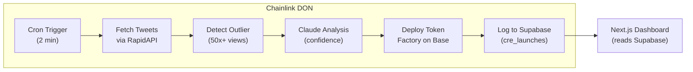
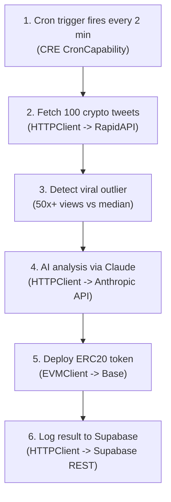
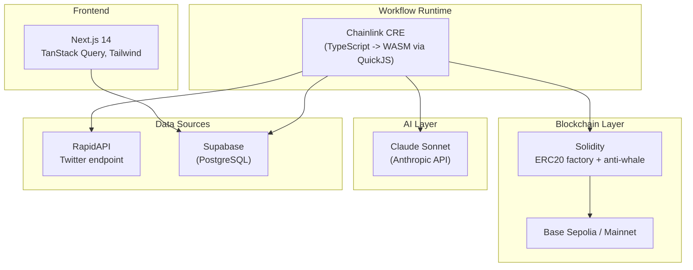
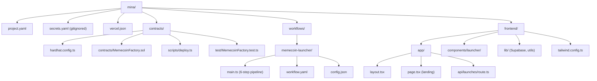
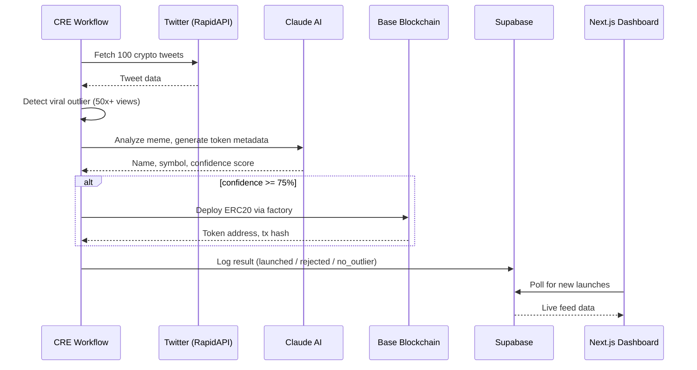

# Mina - AI Memecoin Launcher

Autonomous AI agent that detects viral crypto memes on Twitter and deploys memecoin tokens on Base blockchain, powered by Chainlink CRE.

Built for the **Chainlink CRE & AI Hackathon**.

## Architecture



### Pipeline Steps



### Tech Stack



## Project Structure



## Setup

### Prerequisites

- [Bun](https://bun.sh/) runtime
- [CRE CLI](https://docs.chain.link/cre) installed
- Supabase project
- RapidAPI key (Twitter endpoint)
- Anthropic API key
- Base Sepolia RPC URL + funded deployer wallet

### 1. Install dependencies

```bash
# Workflow
cd workflows/memecoin-launcher && bun install

# Contracts
cd contracts && bun install

# Frontend
cd frontend && bun install
```

### 2. Configure secrets

```bash
cp .env.example .env
# Fill in all keys in .env
```

### 3. Compile and test the contracts

```bash
cd contracts
bun run compile
bun run test
```

### 4. Deploy the factory contract

```bash
cd contracts
bun run deploy:sepolia
# Copy the factory address to .env as FACTORY_ADDRESS
```

### 5. Create Supabase table

Run this SQL in your Supabase SQL editor:

```sql
CREATE TABLE cre_launches (
  id UUID DEFAULT gen_random_uuid() PRIMARY KEY,
  status TEXT NOT NULL CHECK (status IN ('launched', 'rejected', 'no_outlier')),
  tweet_text TEXT,
  tweet_views BIGINT,
  view_multiplier NUMERIC,
  ai_confidence INTEGER,
  token_name TEXT,
  token_symbol TEXT,
  risk_level TEXT,
  tx_hash TEXT,
  token_address TEXT,
  chain TEXT,
  total_supply TEXT,
  created_at TIMESTAMPTZ DEFAULT NOW()
);

-- Public read access, service role write
ALTER TABLE cre_launches ENABLE ROW LEVEL SECURITY;

CREATE POLICY "Public read" ON cre_launches
  FOR SELECT USING (true);

CREATE POLICY "Service write" ON cre_launches
  FOR INSERT WITH CHECK (true);
```

### 6. Run the CRE workflow

```bash
cd workflows/memecoin-launcher
cre workflow simulate
```

### 7. Start the dashboard

```bash
cd frontend
bun dev
```

Open [http://localhost:3000](http://localhost:3000).

### 8. Deploy to Vercel

The project includes a `vercel.json` that points to the `frontend/` directory. To deploy:

```bash
# Install Vercel CLI
npm i -g vercel

# Deploy from the project root
vercel
```

Set the following environment variables in the Vercel dashboard:
- `NEXT_PUBLIC_SUPABASE_URL`
- `NEXT_PUBLIC_SUPABASE_ANON_KEY`

## Smart Contract

**MemecoinFactory.sol** deploys `ViralMemecoin` ERC20 tokens with:

- Anti-whale protection: 1% max transfer limit
- On-chain metadata: source tweet ID, AI confidence score, view count
- `TokenCreated` event for indexing
- Owner can remove transfer limits post-launch

## Configuration

**config.json** (workflow runtime):

| Key | Default | Description |
|-----|---------|-------------|
| `schedule` | `*/2 * * * *` | Cron schedule (every 2 min) |
| `outlierMultiplier` | `50` | Views must be 50x above median |
| `confidenceThreshold` | `75` | Minimum AI confidence to launch |
| `defaultTotalSupply` | `1e27` | 1 billion tokens (18 decimals) |

## Demo



## Author

[@fozagtx](https://github.com/fozagtx)

## License

MIT
